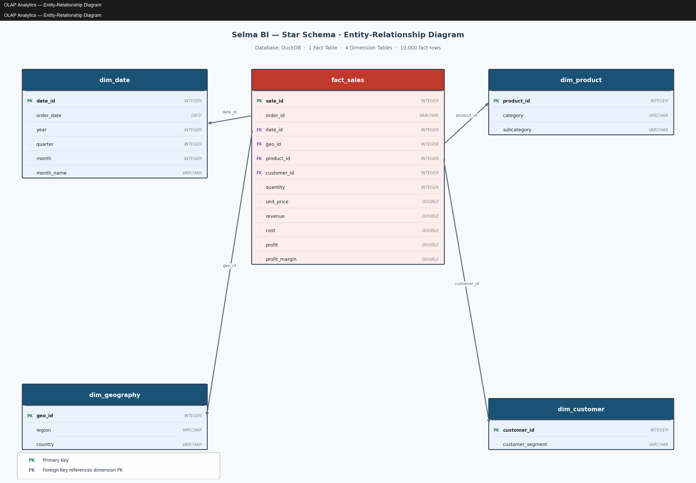
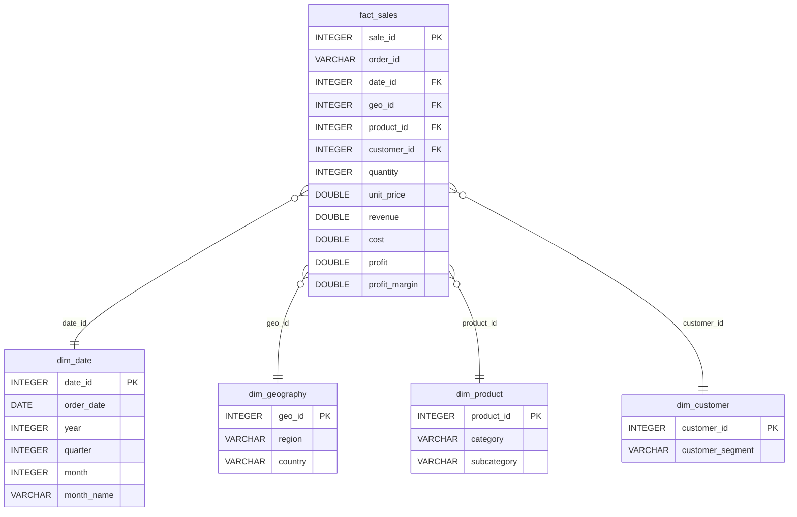

# OLAP Analytics — Entity-Relationship Diagram

**Database:** DuckDB (`data/olap.duckdb`)
**Schema:** Star Schema — 1 Fact Table · 4 Dimension Tables · 10,000 fact rows

---

## ER Diagram (image)



---

## ER Diagram (Mermaid — interactive)



---

## Table Descriptions

### `fact_sales` — Central Fact Table

| Column | Type | Constraint | Description |
|---|---|---|---|
| `sale_id` | INTEGER | PK | Surrogate primary key |
| `order_id` | VARCHAR | NOT NULL | Business order identifier (e.g. `ORD-00001`) |
| `date_id` | INTEGER | FK → `dim_date` | When the sale occurred |
| `geo_id` | INTEGER | FK → `dim_geography` | Where the sale occurred |
| `product_id` | INTEGER | FK → `dim_product` | What was sold |
| `customer_id` | INTEGER | FK → `dim_customer` | Who bought it |
| `quantity` | INTEGER | > 0 | Units sold |
| `unit_price` | DOUBLE | ≥ 0 | Price per unit |
| `revenue` | DOUBLE | ≥ 0 | `quantity × unit_price` |
| `cost` | DOUBLE | ≥ 0 | Cost of goods sold |
| `profit` | DOUBLE | | `revenue − cost` (can be negative) |
| `profit_margin` | DOUBLE | | `(profit / revenue) × 100` (%) |

---

### `dim_date` — Time Dimension

Supports the hierarchy: **Year → Quarter → Month**

| Column | Type | Constraint | Description |
|---|---|---|---|
| `date_id` | INTEGER | PK | Surrogate primary key |
| `order_date` | DATE | NOT NULL | Full calendar date |
| `year` | INTEGER | NOT NULL | 2022 / 2023 / 2024 |
| `quarter` | INTEGER | 1–4 | Q1–Q4 |
| `month` | INTEGER | 1–12 | Month number |
| `month_name` | VARCHAR | NOT NULL | e.g. `January` |

---

### `dim_geography` — Geographic Dimension

Supports the hierarchy: **Region → Country**

| Column | Type | Constraint | Description |
|---|---|---|---|
| `geo_id` | INTEGER | PK | Surrogate primary key |
| `region` | VARCHAR | NOT NULL | North America / Europe / Asia Pacific / Latin America |
| `country` | VARCHAR | NOT NULL | One of 17 countries |

---

### `dim_product` — Product Dimension

Supports the hierarchy: **Category → Subcategory**

| Column | Type | Constraint | Description |
|---|---|---|---|
| `product_id` | INTEGER | PK | Surrogate primary key |
| `category` | VARCHAR | NOT NULL | Electronics / Furniture / Office Supplies / Clothing |
| `subcategory` | VARCHAR | NOT NULL | One of 20 subcategories |

---

### `dim_customer` — Customer Dimension

| Column | Type | Constraint | Description |
|---|---|---|---|
| `customer_id` | INTEGER | PK | Surrogate primary key |
| `customer_segment` | VARCHAR | NOT NULL UNIQUE | Consumer / Corporate / Home Office / Small Business |

---

## Cardinality

| Relationship | Cardinality | Description |
|---|---|---|
| `fact_sales` → `dim_date` | Many-to-One | Many sales on the same date |
| `fact_sales` → `dim_geography` | Many-to-One | Many sales in the same region/country |
| `fact_sales` → `dim_product` | Many-to-One | Many sales of the same product category |
| `fact_sales` → `dim_customer` | Many-to-One | Many sales to the same customer segment |

---

## Data Loading

To (re)build the database from the flat CSV:

```bash
# From the project root:
python database/load_data.py

# Custom paths:
python database/load_data.py \
    --csv  data/sales_data.csv \
    --db   data/olap.duckdb \
    --ddl  database/schema.sql
```

To apply the DDL only (no data):

```bash
duckdb data/olap.duckdb < database/schema.sql
```
